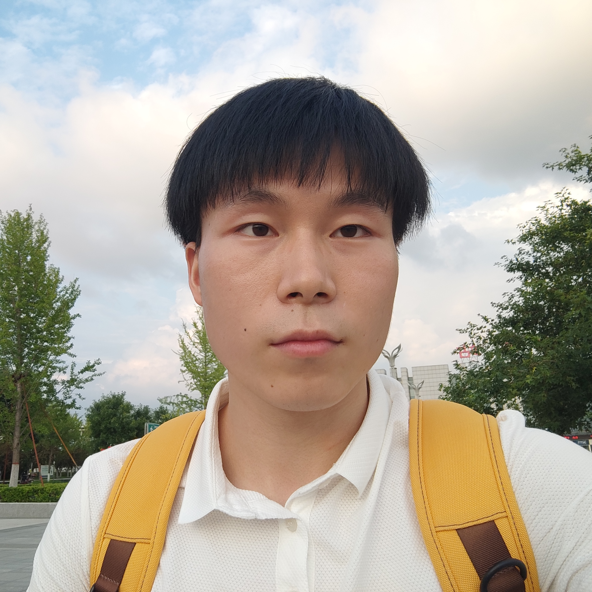
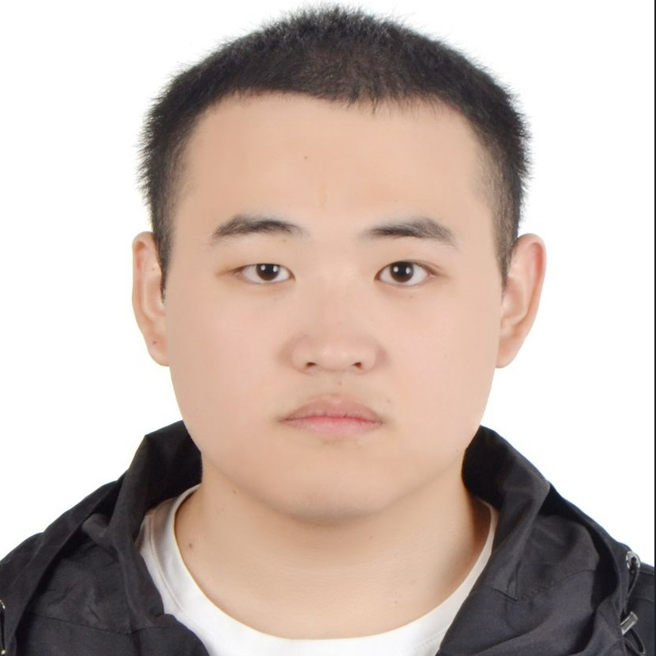
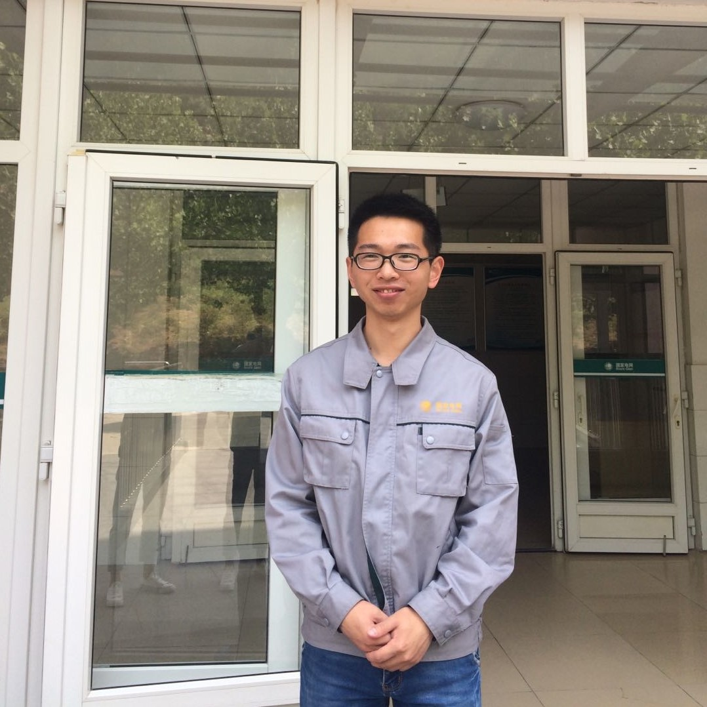
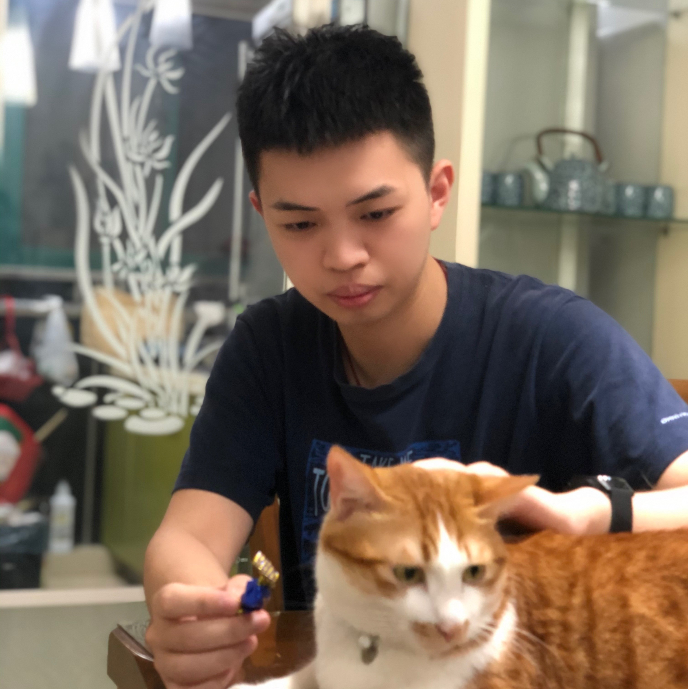
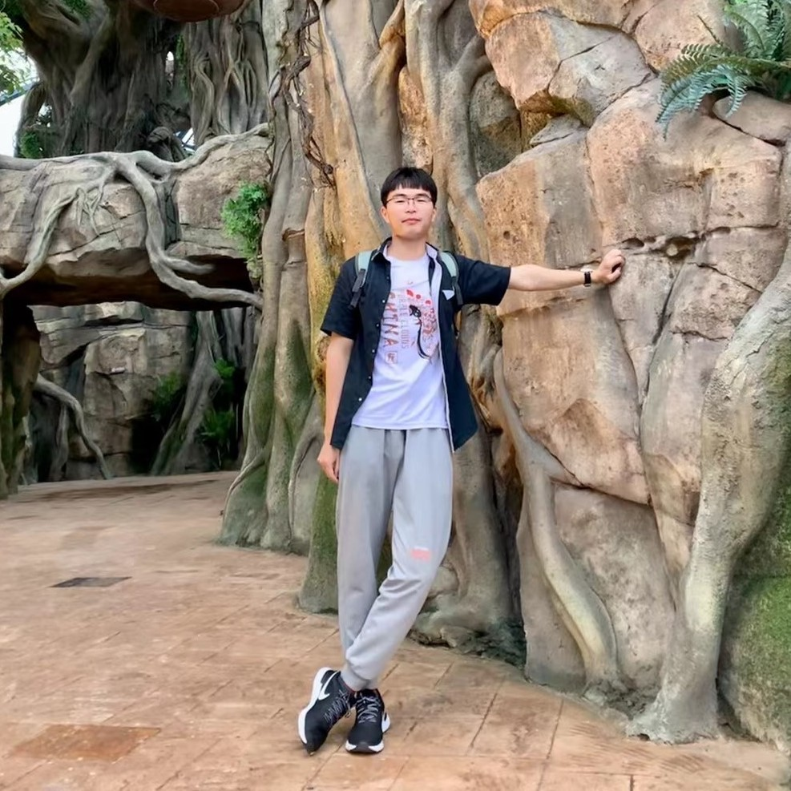
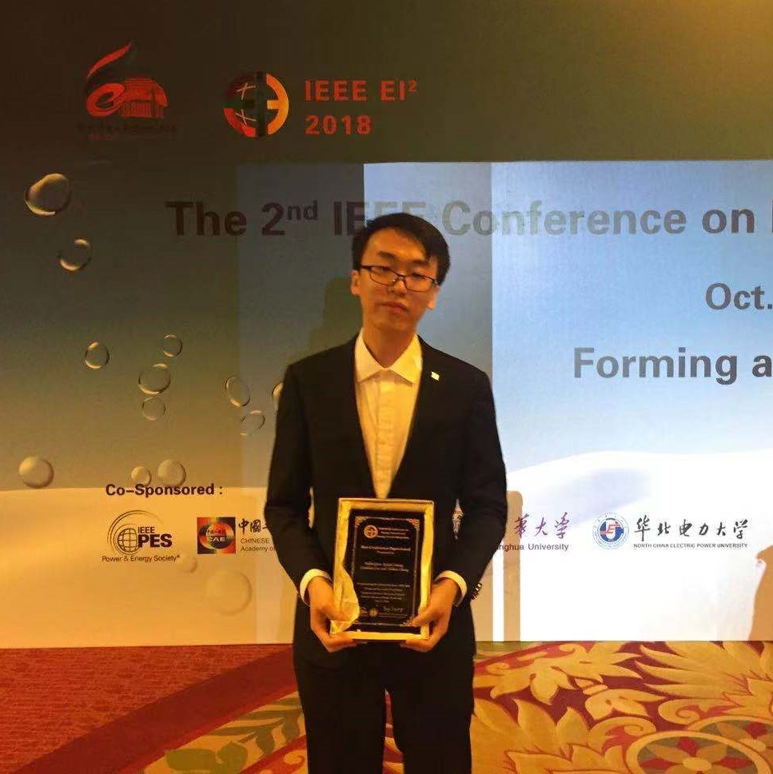

Research Partners
------

 <a href="https://sites.google.com/site/hejunzz/">Jun He</a>

 <a href="http://www.ise.ynu.edu.cn/teacher/805">Hao Wu</a>

 <a href="https://scholar.google.com/citations?hl=zh-CN&user=RjQ5TrEAAAAJ">Aiguo Song</a>

 <a href="https://scholar.google.com/citations?user=QXiEicQAAAAJ">Ming Zeng</a>

Students
------
2021

 <a href="https://github.com/small-volcano">Can Bu</a>

 <a href="https://leizhangnjnu.github.io//alumni/">Lutong Qin</a>

 <a href="https://leizhangnjnu.github.io//alumni/">Ting Xiong</a>

 <a href="https://leizhangnjnu.github.io//alumni/">Shuaishuai Wang</a>

 <a href="https://github.com/cheng-haha">Dongzhou Cheng</a>

 <a href="https://leizhangnjnu.github.io//alumni/">Yufeng Zhan</a>

 <a href="https://leizhangnjnu.github.io//alumni/">Junjie liang</a>

 <a href="https://leizhangnjnu.github.io//alumni/">Guangyu Yang</a>

------
2020

 <a href="https://chauncey-wang.github.io/">Xing Wang</a>

 <a href="https://github.com/xushige">Shige Xu</a>

 <a href="https://github.com/Chaolei98">Chaolei Han</a>

 <a href="">Peitian Chen</a>

Graduate Students
------
2019

 <a href="https://yinntag.github.io/">Yin Tang Ph.D. Candidate in CSU</a>

 <a href="">Wenbin Gao Xiaomi</a>

 <a href="https://wenbohuang1002.github.io/">Wenbo Huang Ph.D. Candidate in SEU</a>

 <a href="">Tianyi Liu Ph.D. Candidate in SEU</a>

 <a href="">Xin Cheng State Grid of China(Shandong)</a>

 <a href="">Weiming Quan State Grid of China(Anhui)</a>

2018

 <a href="https://github.com/tengqi159">Qi Teng Ph.D. Candidate in NJU</a>

 <a href="https://github.com/KennCoder7">Kun Wang Ph.D. Candidate in SEU</a>

 <a href="https://github.com/Divine-w">Zhenyu Wang Ph.D. Candidate in NJU</a>

 <a href=" ">Jinwei Mao Nan Rui</a>

2017

 <a href=" ">Zhihao Zhang Nan Rui</a>

Others

 <a href="https://scholar.google.com/citations?user=yybzbxMAAAAJ">Zhixiang Wang Undergraduate</a>

 <a href="https://claydon-wang.github.io/">Shuoyuan Wang Undergraduate</a>

